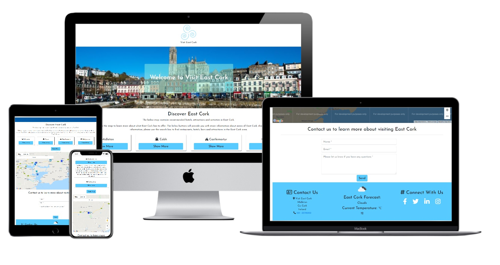

`python3 -m http.server`

# Milestone 2 Project - Visit East Cork

The purpose of this project is to develop an interactive frontend website that promotes the area of East Cork in the South of Ireland. Visit East Cork is a business to consumer website that serves the dual purpose of advertising select companies or activities in the East Cork area but also allows users to discover information themselves and contact the website owner for more information.

The Visit East Cork website is responsive and contains a number of interactive elements including its main functionality based on the Google Maps Javascript API. Elements of this website were developed from the Code Institute coursework as well recommendations from my mentor and independent online research and observations.

You can view the live website here: [Visit East Cork](https://d-mcalpin.github.io/Visit-East-Cork/)

## 1. User Experience

Visit East Cork is a business to consumer website that allows users to discover the local area of East Cork and find out about local facilities, businesses and attractions. The Google Maps element contains a number of custom markers with info windows that can be edited. This would allow the website owner the opportunity to generate advertising revenue from recommended locations in the area while also allowing website users the opportunity to interact with the map and find out more information about the area themselves.

### 1.1 User Stories
- As a local business owner in the East Cork area, I can showcase my business on the Visit East Cork homepage via the Google Maps API interface. This can display images, informationa and links about my business. 

- As a tourist seeking to find more information about East Cork, I can interact with the map aswell as reading the information about local areas displayed on the homepage. Should I wish to find out more information I can contact the website owner directly from the contact form. I can also view the current weather forecast in Cork.

- As a local resident of East Cork, I can interact with the Visit East Cork website to find out more information about my local area, particularly relating to attractions or facilities that I may not know about. I can also view the local weather forecast and contact the site owner if I have any queries.

### 1.2 Strategy
The goal of the project is to create an informative website that has the potential to generate revenue for the website owner through sponsored recommendations visible on the Google Maps API. The website intends to keep users interested through continuously updated local information with the potential to offer special deals on local businesses to website users.

### 1.3 Scope 
All of Visit East Cork's content is contained within a single webpage. Users do not have to navigate away from the page to use different elements including contacting the website owner and interacting with the Google Maps API. Elements of the homepage are interactive including the buttons which showcase the local area. These toggle information and interact with the map to show users where these areas are located.

### 1.4 Structure
Based on the Scope Plane, Visit East Cork was developed to provide users with information within moments of arriving at the page. A welcome image entices users to scroll down and the Google Maps API invites them to click on custom markers to discover the local area. A contact form and contact information is within a scroll of the map.

### 1.5 Skeleton
A mobile first approach was taken to designing the website. The original wireframes were created using Balsamiq and can be found below:

- Mobile Wireframe PDF - <a href="https://drive.google.com/open?id=139CHAjLGGtWzUlTY-bNublwHJQya23ho" rel="noopener" target="_blank">mobile version in PDF</a>.
- Desktop Wireframe PDF - <a href="https://drive.google.com/open?id=1ifq59VU_6UHgPFWvrcPonn4IZ5hT-syk" rel="noopener" target="_blank">desktop version in PDF</a>.

The wireframe mockups gave me a basic idea of how best to lay out each individual element that I wanted to incorporate into the project and how that would impact and enhance the user experience. As the project progressed, how best to place each of these elements became apparent.

### 1.6 Surface
A blue and white colour scheme was initially decided upon to give a clean and crisp image to the site, I decided to add a teal colour, particularly for buttons and hover elemenets early on in the project. I chose the Quicksand font from Google Fonts as it fit in with my intended design. A mixture of rounded borders and angled borders as well as shadowing appear on different elements throughout the site in order to improve visual appeal.
***

## Scope
* Users can find the location of recommended attractions, restaurants or areas on a map.
* Users can read more about each of the recommended attractions, restaurants or areas.
* Show the users current location on the island and their position near recommended areas
* Email the site owner for more information

## Existing Website Features
Navigation: The main navigation includes a link to each of the main sections of the site, which answer each of the user questions, and is styled clear, simple and modern.

Google Maps API – Using the Google Maps API, all recommendations will be added as custom markers to an inbuilt map.

Search Google Maps Places – Allowing the ability for the user to search for other places of interest outside those recommended, including restaurants, attractions, beaches and more. This will allow the user to be able to find all they need in the one website rather than using multiple.

Contact Form – The contact form is an easy and direct way for the user to ask a question to the site owner. [EmailJS](https://www.emailjs.com/) sends the email directly from the website to the website owner.

## Features to implement in the future
There are a couple of features I would like to implement in the future to make the map feature even more user friendly.
* Auto closing of custom marker labels - Custom markers can be closed by clicking the X in the top right cornder, however I would like them to close automatically when another marker is clicked.
* Show user location on the map - I would like to add this feature so that a user can easily see their location compared to the recomendations. 

## Technologies Used
I used a number of languages, frameworks and tools to construct my website. These include;
* [HTML](https://html.com/)
* [CSS](https://www.w3.org/Style/CSS/Overview.en.html) 
* [JavaScript](https://www.javascript.com/) 
* [JavaQuery](https://jquery.com/)
* [Bootstrap](https://getbootstrap.com/)
* [GitHub](https://github.com/)
* [GitPod](https://www.gitpod.io/)
* [Google Maps API](https://developers.google.com/maps/documentation)
* [EmailJS](https://www.emailjs.com/)

## Tools Used
* [Balsamiq](https://balsamiq.com/) - Used to create my wireframes, showing the positioning of elements on varying screen sizes.
* [Adobe Photoshop](https://www.adobe.com/uk/products/photoshop.html) - Photoshop was used to create the website logo.
* [W3C HTML Validator](https://validator.w3.org/) - I used this tool to check the validity of my HTML code.
* [W3C CSS Validator](https://jigsaw.w3.org/css-validator/) - I used this tool to check the validity of my CSS code.
* [Autoprefixed](https://autoprefixer.github.io/) - I used this tool to check the prefixes of my CSS code.

## Testing

**W3C HTML Validator**
* Ran index.html through validator to check there were no syntax errors: 
    * Failed – 3 images were missing alt tags
        * Alt tags added and tested again
	* Passed

**W3C CSS Validator**
W3C CSS Validator
* Ran style.css through validator to check there were no syntax errors: 
    * Passed with no errors

**User stories**

*As a user who is looking to visit, or currently visiting Mykonos, I want to learn more about the best things to see on Mykonos, recommended restaurants on Mykonos, and learn about the different areas of Mykonos.*
* Recommendations on the website have been split into 3 simple and clear categories: Attractions, Restaurants and Areas.
* These sections are available to the viewer upon landing on the site in the simple and clean navigation.
    * When a user clicks on one of these navigation items, the site is expected to take the user directly to the corresponding section
        * Upon testing, the site responds as expected. (Full navigation testing below).
* The 3 categories are again available below the jumbotron, with images to represent each category, a title, and clear ‘Show Me’ call to action buttons.
    * When a user clicks on one of these ‘Show me’ buttons, the site is expected to take the user directly to the corresponding section
        * Upon testing, the site responds as expected and takes the user to the selected section of the website. (Full 3 Topics testing below).
* The 3 category sections are also titled with headers clearly to match the category names.
* All of these options give the user multiple ways to find the content for the best things to see on Mykonos.

*As a user, I want to be able to contact the admin of the website to be able to ask for more information.* 
* A clear Contact Us navigation item is visible on the main navigation bar as soon as the user lands on the site. 
* This links the user to a Contact Us form at the bottom of the homepage, making it easy for the user to send a message to the site owner, and for the user to not have to leave the site to send the message from an email client.
* When a user clicks on the Contact Us navigation item, the site is expected to take the user to the Contact Us form, which the user can then fill in. 
    * Upon testing, the site acts as expected and takes the user to the form. (Full Contact form testing below).

*As a user, I want to be able to locate the recommended places shown to me on the website on a map.*
* All recommendations have been individually added to a Google Map embedded into the website.
* Each item has been added to the map using 1 of 3 custom icons which represent each of the 3 categories, making the markers clear and distinguishable.
* Each marker includes a popup label which includes the same image and title of the recommendation as to the listed recommendation further down the page for familiarity and ease of location, as well as a link back to the recommendation listed on the homepage.
* The map can be found easily by the user via the main navigation item ‘Map’
* The site is expected to take the user to the map section of the website when the ‘Map’ navigation item is clicked.
    * Upon testing, the site acted as expected, taking the user swiftly and simply to the map. (More map and navigation technical tests conducted below.)

*As a user, I want to be able to find other places on a map, such as restaurants, cafes, beaches and more.*
* By installing the Google Places API and a search box, users can type in a search term or specific place.
* Results are returned by Google Places and marked on the map with a red marker.
* The map and search bar can be found easily by the user via the main navigation item ‘Map’ 

**Further testing**
* The website as tested on Google Chrome, Internet Explorer and Firefox browsers.
* The website was viewed on a variety of devices including Desktop, Laptop, iPad, and the mobile options provided by Google chrome developer tools.

**You can find a full document to all the website testing [by clicking here](assets/readme_docs/testing.pdf)

## Design

**Logo:** 
I decided to stick with a traditional Greek design for the logo with a Greek-style font and bright blue colour. The font is called Adonais and is 100% free to use from the website [DaFont](https://www.dafont.com/) 

**Fonts**  
I wanted to keep the rest of the site nice, clear and simple. Therefore, I decided to pair the Google fonts Raleway Light for the headers with Opens Sans Regular for the body text. Both fonts were assigned the backup front of sans-serif.

**Colours:** 
In keeping with a clean and clear website, I opted to use just one main accent colour to complement the lovely colours of the photos. Greece, and the Greek Islands, are known for this bright blue, so I chose one which I felt was a nice modern blue, and once which would be great for text to set out on. This was coupled with a light grey for hover state on the navbar, as well as a dark grey and off white for the copy.

* Blue accent colour: #0086FF
* Hover grey nav bar: #d0d0d5
* Off White: #F8F8FF
* Grey: #222222

## Deployment
I deployed Mykonos Recommended GitHub pages using the following steps:
1. Logging into my GitHub account and locating my repository
1. Clicking on the Settings icon (near the top right of the page)
1. Scrolling down the page to locate the 'GitHub Pages' section
1. I selected 'Master branch' in the dropdown
1. This deployed my project to the URL: https://michellelclement.github.io/mykonos-recommended-MS2/

[Click here to view the live Mykonos Recommended website](https://michellelclement.github.io/mykonos-recommended-MS2/) 

## Credits

**Content**
Website Text: All the text for the website was written by myself.

**Media**
All images used on the website were a mix of my own photographs, Google Images or images from Restaurant social channels.
* Restaurants – Images from their social media pages or website
* Ornos & Platis Gialos – Google Images (labelled for reuse with modification)
* All other photos are my own
* Apple products mockups for README doc by Vinay Mittal via [Graphic Burger](https://graphicburger.com/)
* iPhone 6 Mockups for testing and README document obtained from Graphic Burger and created by [p-px](http://p-px.com)

## Acknowledgements
Google Maps Custom Icons: I used [Maps Icons Collection](https://mapicons.mapsmarker.com) for the custom markers on the map. The website allowed me to customise the markers to my own colourway before implementing on the website.

In addition to assistance from my mentor and the slack community, I also found answers to some of my questions and troubleshooting errors by searching previously answered questions on the [Stack Overflow](https://stackoverflow.com/) website.

A thank you to Murray Bealby for taking the time to look at my project via the Peer Code Review Slack channel and giving a few tips on improving some areas of my project.

Special Thank you to my fantastic mentor ADEGBENGA ADEYE for helping me with my ideas and directing me on how to fix errors and bugs.

**Additional Support**
Due to the complex nature of Google APIs, I followed a couple of tutorials to help implement adding multiple custom markers with custom icons, plus installing the Google Places with a search bar. Both tutorials were fantastic and really helped to cement how to do this with more explanation on the why, and how, compared to Google’s documentation. I have marked with comments on the map.js file the code which was assisted by both tutorials. In both cases, I implemented as much of the code myself as possible using my knowledge from the course material and Google’s Documentation, and then the tutorials helped implement the exact features and functionality I desired.

* [Google Maps Tutorial](https://www.youtube.com/watch?v=Zxf1mnP5zcw)
* [Google Maps Places Tutorial](https://www.youtube.com/watch?v=oVr6unKZbg4)

As advised by my mentor, I decided to add a 'Back To Top' scroll button due to the page being quite long on mobile devices. This isn't something which has been covered in the course material, so I followed the instructions to do this as provided by [W3Schools](https://www.w3schools.com/).